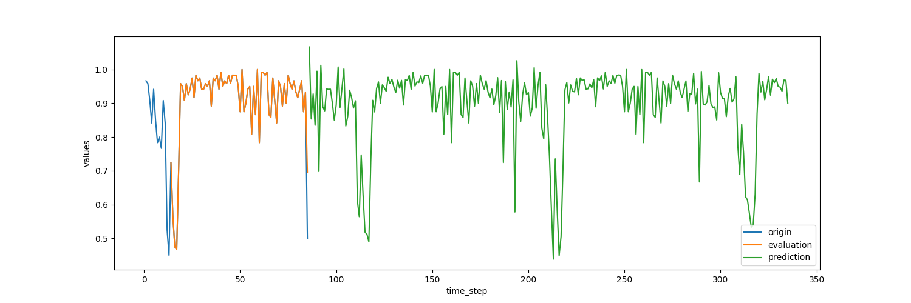
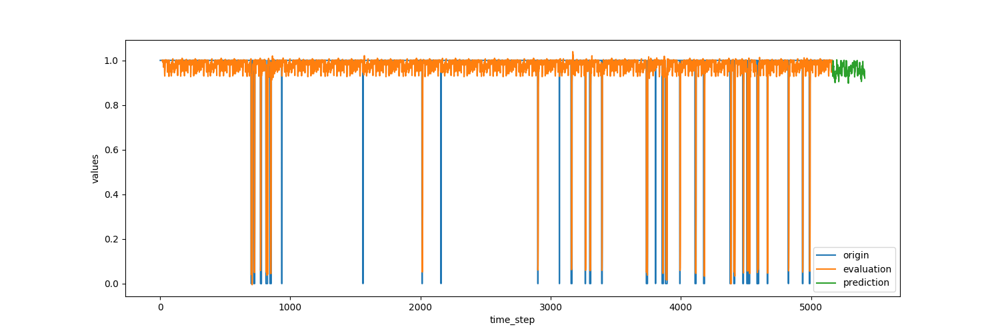
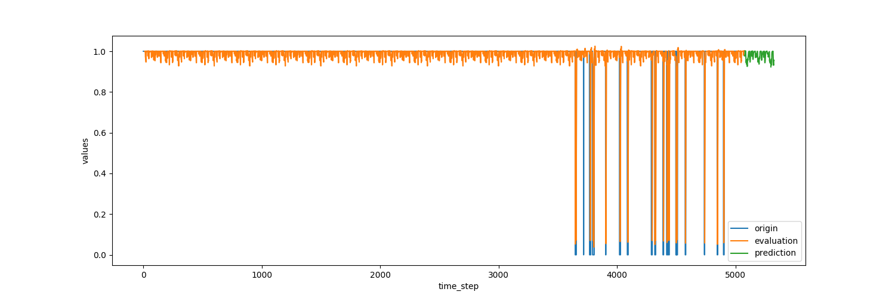

# Intelligent-Monitoring
Using Data Science techniques for intelligent monitoring at large scale

Intelligent Monitoring is a project working to leverage Data Science techniques for better insights into the overall health of systems.  The goals is to achieve more then a static binary check for the systems health. Instead, to develop a dynamically changing module that will give insight to a wide range of different "sick" systems and provide recommendations of how to heal.  

## Goals of the Project

- Better insight into the health and status of all systems
- Predictive vs Reactive monitoring
- Self Healing networks that able to detect and solve issues without human interaction
- Predictive capacity management and operational planning

## Data Gathering Tools

Prometheus was chosen for the bullet points below:

- Dimensional Data
- Great visualization
- Many Integrations
- Precise alerting
- Simple Operations

## Data Cleaning and Normalization

With each subset of data collected there is a specific cleaning and normalization that takes place to keep in sync.  Normalization is achieved by the exporter on the client side at scrape.

## Midway Checkpoint Update

At week 8 the goal was to have all data collecting and normalized in a consistent way for further processing in the future.  Data is scrapped and available in Prometheus.  Below are example queries and filters being run through Prometheus visualization tool in order to show data being gathered.

First we can look at the average response time in seconds of a particular service.

Same reponse time filtered by host for more granularity

Standard Var and Dev over time for the response time.

Each prometheus query available to be visualized via many different options. (Grafana shows)

## Midway Checkpoint Update

At week 16 the goal of this project was to achieve more then a static binary check for the systems health. Instead, to develop a dynamically changing module that will give insight to a wide range of different "sick" systems.  Also, we wanted to have a good idea of how to give recommendations to users on how to heal their sick systems. We were able to achieve our goal on a small PoC neuro network and are excited about the future of the project going forward.

Leveraged Tensorflow Library in python to Build a Neuro Network for Time series predictions and give an estimated value of what health of our systems based on trained data.

https://www.tensorflow.org/

Python Package Dependencies:

1. numpy
2. matplotlib
3. tensorflow
4. pandas

Example results for One system health Check:

Health check tracer bulled to define when a system is healthy or not. This is a good way for us to define dynamically what we expect to see. Code for actual health check is not included as it varies per service. But the module included is what defines how the data is categorized.

Based on the results of the health check, we pull in other data around the service and compare the output of that prediction to what the health check is showing. This gives an idea of what is causing the health check to be unhealthy.

