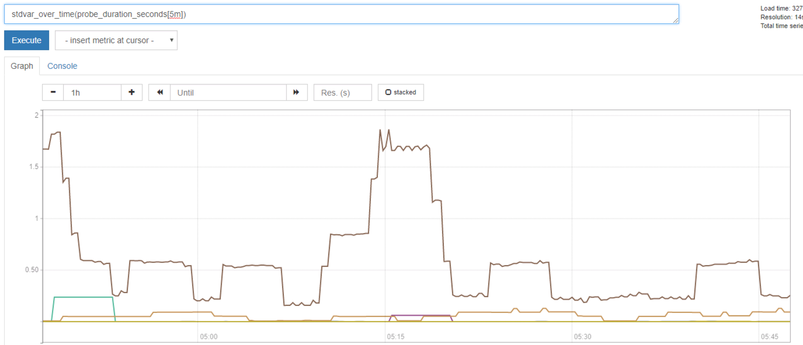
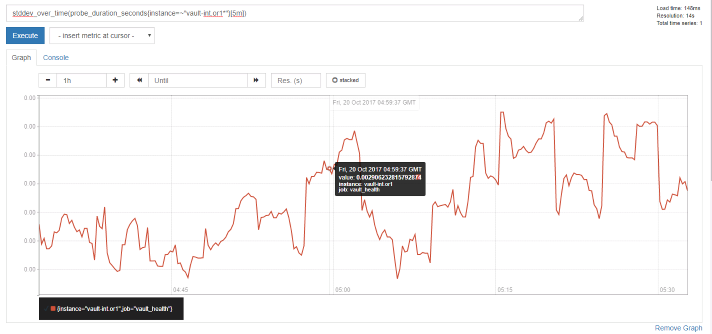
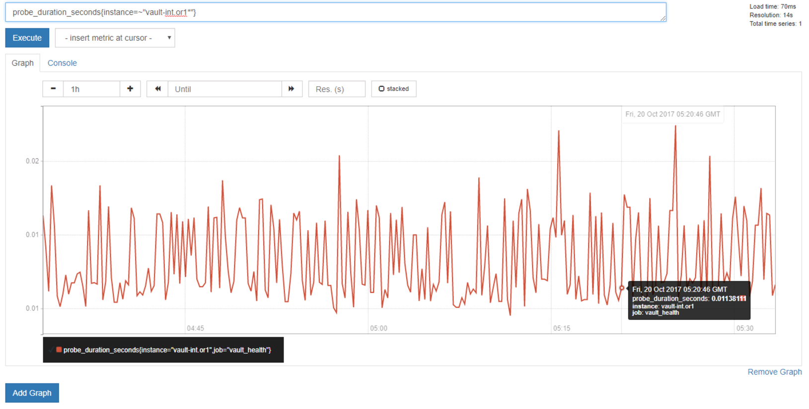
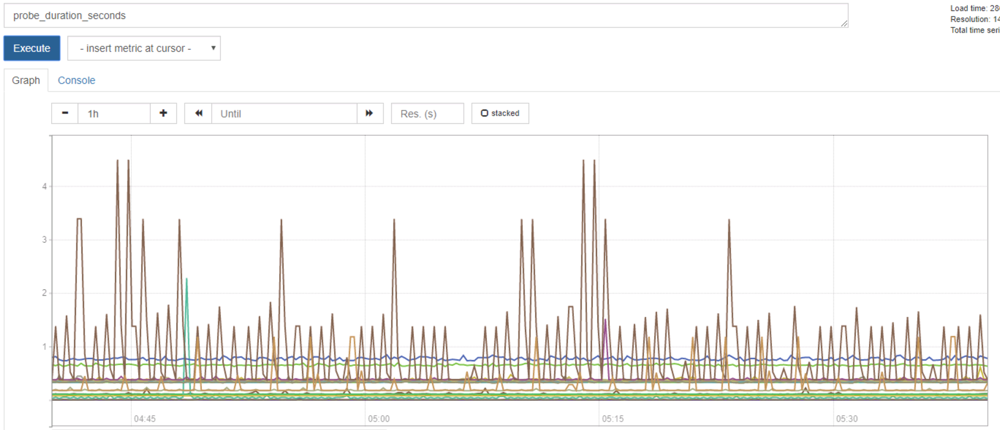
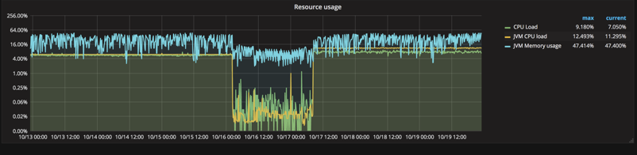
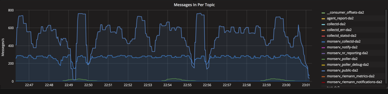

# Intelligent-Monitoring
Using Data Science techniques for intelligent monitoring at large scale

Intelligent Monitoring is a project working to leverage Data Science techniques for better insights into the overall health of systems.  The goals is to achieve more then a static binary check for the systems health. Instead, to develop a dynamically changing module that will give insight to a wide range of different "sick" systems and provide recommendations of how to heal.  

## Goals of the Project

- Better insight into the health and status of all systems
- Predictive vs Reactive monitoring
- Self Healing networks that able to detect and solve issues without human interaction
- Predictive capacity management and operational planning

## Data Gathering Tools

Prometheus was chosen for the bullet points below:

- Dimensional Data
- Great visualization
- Many Integrations 
- Precise alerting
- Simple Operations

## Data Cleaning and Normalization 

With each subset of data collected there is a specific cleaning and normalization that takes place to keep in sync.  Normalization is achieved by the exporter on the client side at scrape. 

## Midway Checkpoint Update

At week 8 the goal was to have all data collecting and normalized in a consistent way for further processing in the future.  Data is scrapped and available in Prometheus.  Below are example queries and filters being run through Prometheus visualization tool in order to show data being gathered.

